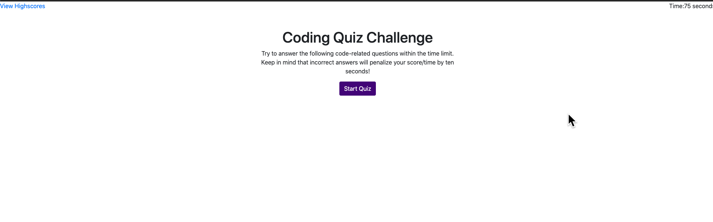

# Web_API_Code_Quiz

David K. Brown's Web API Code Quiz

## Table of Contents

- [Description](#description)

- [Screenshots](#screenshots)

- [Acceptance-Criteria](#Acceptance-Criteria)

- [Installation](#installation)

- [Credits](#credits)

- [Contributing](#contributing)

- [Copyright](#copyright)

## Description

This website was created to test a user's knowledge of Web API Code. When the quiz is started the timer should count down and for each incorrect answer be subtracted by 15 seconds (this was changed from 10 to 15 due to the gif being incorrect). At the end of the quiz the user is given the option to enter their credentials so that their highscore can be saved on another page. This is the expected outcome.

## Screenshots



## Acceptance-Criteria

```
GIVEN I am taking a code quiz
WHEN I click the start button
THEN a timer starts and I am presented with a question
WHEN I answer a question
THEN I am presented with another question
WHEN I answer a question incorrectly
THEN time is subtracted from the clock
WHEN all questions are answered or the timer reaches 0
THEN the game is over
WHEN the game is over
THEN I can save my initials and score
```

## Installation

To access this project you will need to visit my GitHub page and the "Web_API_Code_Quiz" repository. After the repository is cloned you can make edits to the project in your repository. Any questions should be directed to [David Brown](mailto:gatech55@gmail.com). The project can be found here: [Web_API_Code_Quiz](https://github.com/GaTech55/Web_API_Code_Quiz). The website can be found here: [Web API Code Quiz](https://gatech55.github.io/Web_API_Code_Quiz/).

## Credits

© 2019 Trilogy Education Services, a 2U, Inc. brand. All Rights Reserved.
[GitLab-04-Homework](https://gt.bootcampcontent.com/GT-Coding-Boot-Camp/gt-inc-fsf-pt-08-2020-u-c/tree/master/04-Web-APIs/02-Homework)

## Contributing

| **Commits** | **Contributor** |

| 17 | [GaTech55](https://github.com/GaTech55)|

## Copyright

Copyright (c) 2020 David Brown.
